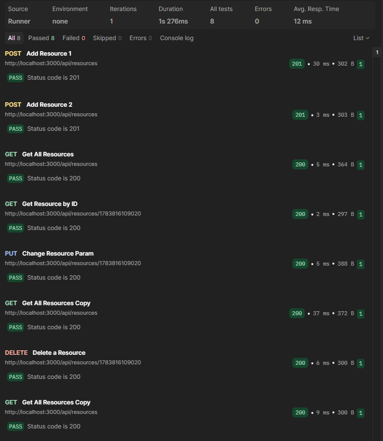

# Description
Educational Node.js/Express program that has the proper routes and fetch methods to perform basic database operations to a local JSON array serving as a mock database.

These methods include:
- GET /api/resources - Returns the full mock DB
- GET /api/resources/{id} - Returns the DB item that matches the id in the parameters
- POST /api/resources - Adds a new item to the mock DB, takes a json object with the following format: { name: String, address: String }
- PUT /api/resources/{id} - Modifys the elements of the specified item in the mock DB, takes a json object that must have one of the following: { name: String, address: String }.
- DELETE /api/resources/{id} - Deletes the specified item in the mock DB

# Postman Testing Steps
In order to test that the mock DB/API was working properly, I used postman automated testing, having it run a collection of 8 different http requests in the following order
### 1. POST localhost:3000/api/resources

  Request data:
  
```js
{
    "name": "John",
    "address": "1234 Real St."
}
```
  Response data:

```js
{
    "id": "1783816109020",
    "name": "John",
    "address": "1234 Real St."
}
```

### 2. POST localhost:3000/api/resources

  Request data:
  
```js
{
    "name": "Alice",
    "address": "4321 Fake Av."
}
```
  Response data:

```js
{
    "id": "1783816109116",
    "name": "Alice",
    "address": "4321 Fake Av."
}
```

### 3. GET localhost:3000/api/resources
  Response data:

```js
[
    {
        "id": "1783816109020",
        "name": "John",
        "address": "1234 Real St."
    },
    {
        "id": "1783816109116",
        "name": "Alice",
        "address": "4321 Fake Av."
    }
]
```

### 4. GET localhost:3000/api/resources/1783816109020
  Response data:

```js
{
    "id": "1783816109020",
    "name": "John",
    "address": "1234 Real St."
}
```

### 5. PUT localhost:3000/api/resources/1783816109020
   Request data:
  
```js
{
    "address": "4567 New Address Drv."
}
```

  Response data:

```js
{
    "before": {
        "id": "1783816109020",
        "name": "John",
        "address": "1234 Real St."
    },
    "after": {
        "id": "1783816109020",
        "name": "John",
        "address": "4567 New Address Drv."
    }
}
```

### 6. GET localhost:3000/api/resources
  Response data:

```js
[
    {
        "id": "1783816109020",
        "name": "John",
        "address": "4567 New Address Drv."
    },
    {
        "id": "1783816109116",
        "name": "Alice",
        "address": "4321 Fake Av."
    }
]
```

### 7. DELETE localhost:3000/api/resources/1783816109020
  Response data:

```js
{
    "message": "Deletion of item with id = 1783816109020 successful"
}
```

### 8. GET localhost:3000/api/resources
  Response data:

```js
[
    {
        "id": "1783816109116",
        "name": "Alice",
        "address": "4321 Fake Av."
    }
]
```

### Screen Capture of Postman Test Results


